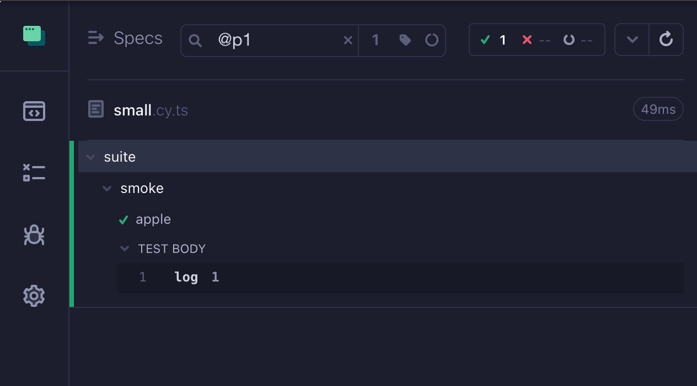
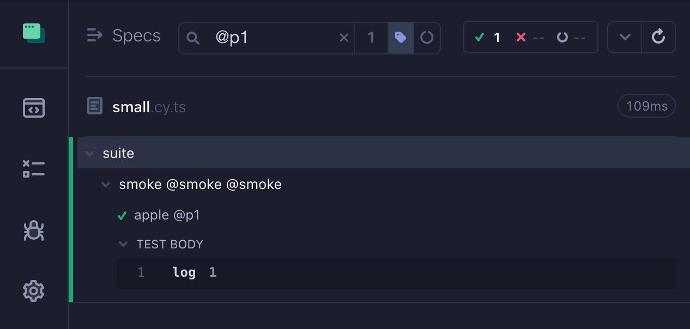
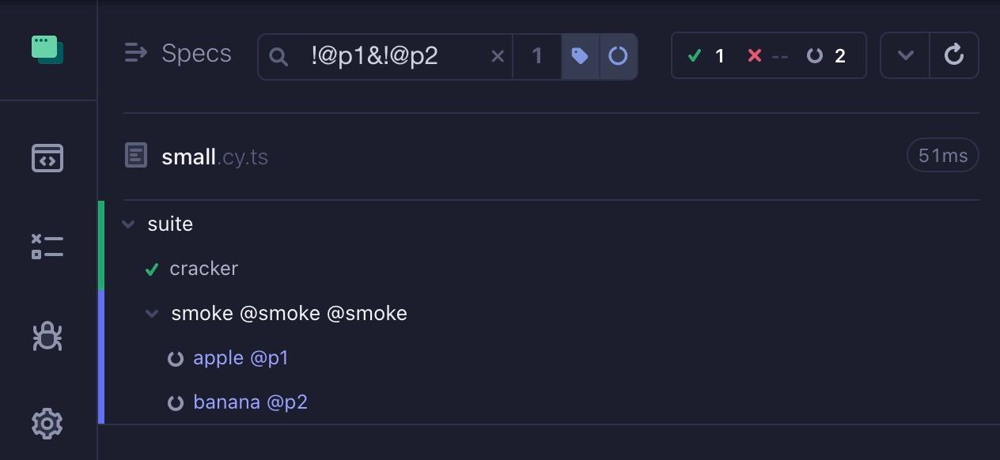

# @mmisty/cypress-grep
This package filters tests by tags or by title using substring or regular expressions.

Also package allows to add UI control with ability to filter tests in selected file

### Run tests by tag
Run by @P1


Show tags in title


Show tags in title and show excluded tests


### Run tests by combination:


## Installation

```
npm i @mmisty/cypress-grep
```

### Setup

```javascript
// setup.ts
import { registerCypressGrep } from '@mmisty/cypress-grep';

registerCypressGrep({
  // will affect only Interactive mode
  addControlToUI: true,
  
  // you can create environment variable to show tags in title if necessary
  showTagsInTitle: true,
  
  // this will be controllable in Interactive mode 
  showExcludedTests: true, 
  
});
```

### Specify tags
Tags could be specified in different ways:
 - just input inline tags in test or suite title like `@smoke`
 - add config to suite or test `{ tags: '@smoke' }` or `{ tags: ['@smoke'] }`
 
    ```javascript
    describe('login', { tags: '@smoke' }, () => {
      it('should login @P0 @regression', ()=> {
        // ...
      });
   
      it('special case on login', { tags: ['@P1', '@regression'] }, () => {
        // ...
      });
    });
    
    ```

### Run by tags
To run by tags you need to specify environment variable 'GREP'

I used to run it by `CYPRESS_GREP='@smoke' npm run cy:run`

Here are some examples: 
- `!@` - run all tests without tags
- `@e2e|@regression` - OR: runs all tests with `@e2e` or `@regression`
- `@e2e/@regression` - OR: runs all tests with `@e2e` or `@regression`
- `@P2&@GG` - AND: runs all tests with `@P2` AND `@GG`
- `@smoke&!@P2&!@P1` - AND with EXCLUSION: runs all tests with `smoke` and without `@P2` and without `@P1`
- `(@P1|@P2)&!@smoke` - AND with EXCLUSION: runs all tests with `@P2` or `@P1` and without `@smoke`
- `(@P[12])&!@smoke` - AND with EXCLUSION: runs all tests with `@P2` or `@P1` and without `@smoke`

There is also possibility to input pure regexp:
- `=/(?=.*@smoke)(?=.*@p1).*/i` - AND - runs all tests that have `@smoke` and `@p1` tags
- `=/^(?!.*@smoke)(?!.*@p1).*$/i` - runs all tests WITHOUT `@smoke` and WITHOUT `@tags`
- `=/(?=.*@smoke)(?=.*@p1).*/i` - Exclude (can be used `!` at the beggining of line to inverse the whole expression) - runs all tests WITHOUT `@gg` and WITHOUT `@tags`
- `=/(?!.*@smoke)(?=.*@p1)/i` - runs all tests WITHOUT `@smoke` and with `@tags`
- `=/@P[12]/` - runs all tests with `@P1` or `@P2`


